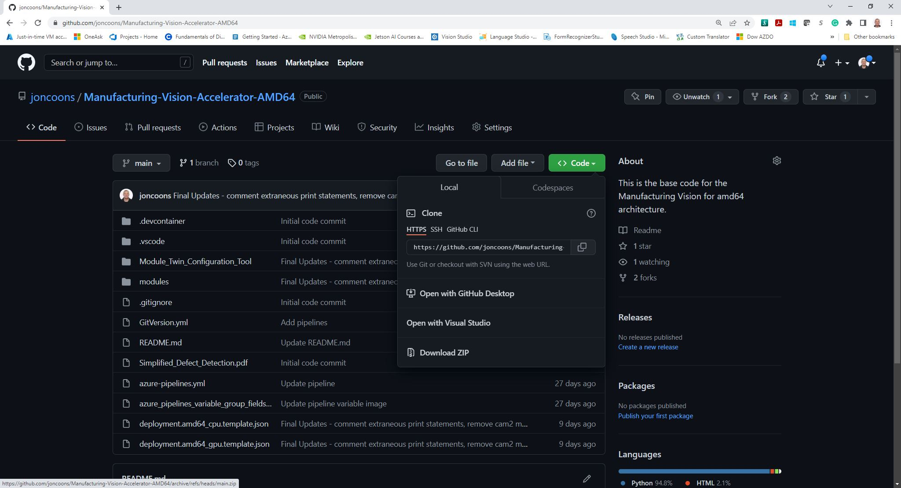

## 4) Download the Code
   
   Now for the easiest portion of the HoL -- we're going to download a zip file of this repository.  Just click on the <>Code button and choose the Download Zip option.    On Windows, this will simply download into your Downloads folder - navigate to this folder, and move the zip to a folder of your choosing for your development environment. Go ahead and unzip the contents there.
   
   
   
   For the lab, we'll be using VS Code  - if you don't have a this installed on your PC, it's free to download and use for any  OS, and and be found [here]([Download Visual Studio Code - Mac, Linux, Windows](https://code.visualstudio.com/download)).
   
   In VS Code, go the File -> Open Folder and choose the MANUFACTURING-VISION-ACCELERATOR-AMD64 folder.   This will open the project in your IDE, and we can now walk through the code to give you better idea of how the solution functions.

[Back to HoL main](../../Hands-on-Lab.md)