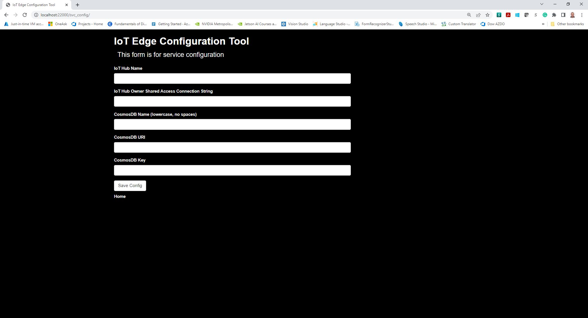
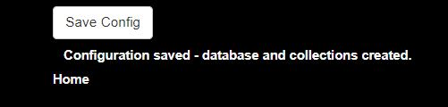
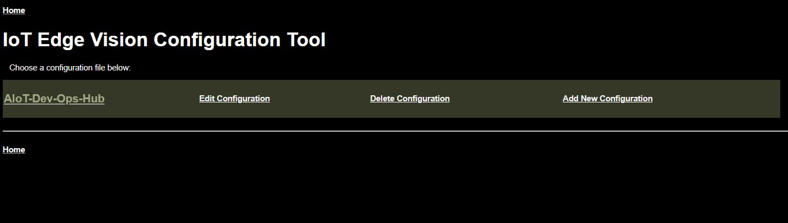
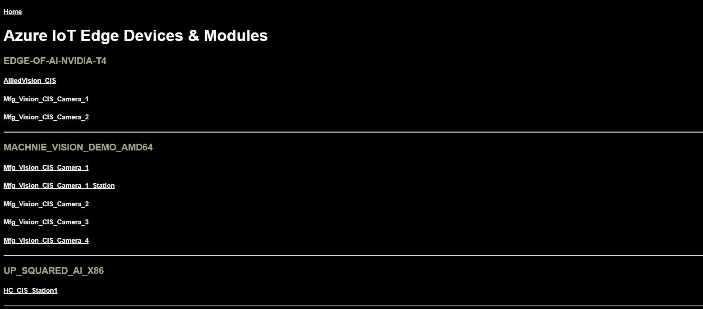
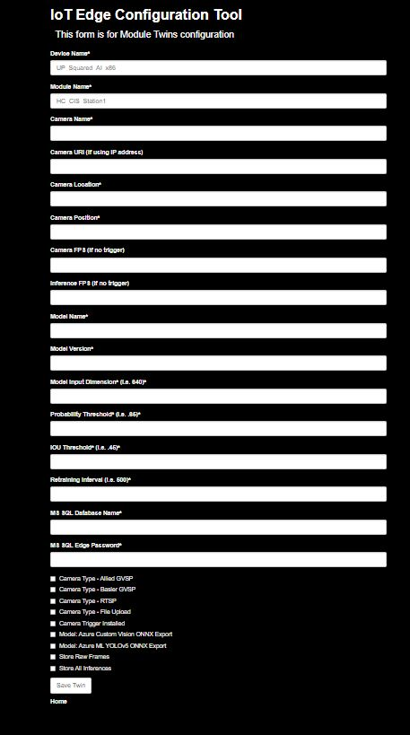

## 5) Set up your Twin Configuration Tool 

Perhaps you noticed, there are two very similar folders in the repository - one inside of the 'modules' folder, labeled 'Mfg_Vision_Twin_Configuration_Tool,' and in the root directory, simply labeled 'Module_Twin_Configuration_Tool.'  The only difference between the two is where you choose to run the containerized application tool.  If you would like to run the configuration tool on your Edge device for testing, you can deploy it as part of your manifest.  If you want to run it locally on your desktop, you can choose other directory - build instructions are located at the top of the dockerfile, as well as run instructions.

If you want an 'easy button' and don't want to build the application container, we've stored a copy in an Azure Container Repository with anonymous pull capabilities.  
Simply run:  

'docker run -d -p 22000:22000 --rm -it visionaccelerator.azurecr.io/iot_edge_configuration_tool:0.0.1-amd64' on your command line or in PowerShell, or add 'sudo' at the beginning if using WSL2.

If you want to run the container and store the config file locally (so you don't have to enter it every time), you could run something like (in WSL2):

'sudo docker run -d -p 22000:22000 --rm -it --mount type=bind,src=/mnt/c/edge_config,dst=/app/config visionaccelerator.azurecr.io/iot_edge_configuration_tool:0.0.1-amd64'

This will create a bind between the /app/config directory in the container to the /mnt/c/edge_config directory on your PC.

In your web browser, open a window and navigate to 'http://localhost:22000'  This will open to the following screen: 

Go ahead and copy/paste the information from your text editor into the appropriate fields - for the CosmosDB name, you can must only use lowercase alphanumeric characters and hyphens for your naming convention.  Click on the 'Save Config' button, and wait for for the following message to appear:

Now click on the 'Home' link at the bottom of the screen - this will take you to the configuration screen.  

You should see your IoT Hub listed as a link in this window.  Click on your IoT Hub and wait for the screen to populate with modules - be patient as this may take some time. Since we're starting from scratch, there won't be any entries quite yet, but when the solution is deployed, the application will cycling through all of modules which have 'CIS' in the name, and you'll end up with a screen that looks like the following:

For illustration, if I select one of the modules listed, a new form will open to configure the module twins

The first two fields, 'Device Name' and 'Module Name,' will be automatically populated for you, but let's go through the remainder of the fields in the example form, which is 100% customizable, if you so choose:

#### Camera Name (string)  
This is what every friendly name you want to give your camera.  This name will display on the custom dashboard.

Camera URI (string) 
Just as it states, this will be the URI or RTSP address if using an IP camera.

Camera Location (string) 
This is a user-defined field, and is used for the image naming convention in the code.  This could be a physical address, manufacturing line id or other naming convention of your choosing.

Camera Position (string) 
This is another user-defined descriptor, which could be the location on a line or angle of capture, i.e. top, bottom, side, etc.,

Camera FPS (integer) 
If using a camera that doesn't have a hardware/software trigger, you simply input the number of frames per second the camera is capturing.  For instance, an RTSP demo camera might be capable of capturing 25 frames per second, so 25 would the value for this field.

Inference FPS (float) 
If your installation doesn't have a trigger, and you typically don't want to inference every single frame, this field allows you to define how many frames per second are actually analyzed.  If you wanted to do less than one frame per second, you would plug in a decimal number, i.e. .2 for the value would mean one frame every five seconds is evaluated by the model.

Model Name (string) 
This correlates to the diretory name of your model in the Mfg_Vision_Model_Repo module.  

Model Version (integer) 
This refers to the version number inside of the model directory of the Mfg_Vision_Model_Repo module.

Model Input Dimension (integer) 
This is the model dimension for the resolution the vision model was trained at.  For instance, the Azure Machine Learning AutoML for Images YOLOv5 algorithm defaults to 640 pixels, which is what the model expects for image size exactly.  This value is utilized by the frame_preprocess.py script in the Mfg_Vision_CIS_Camera_1 module to 'letterbox' the image, resizing the long side to 640 while adding a border if the image is not square.  For the Azure Custom Vision, this is trained at a resolution of 416 pixels, but is a bit mmore forgiviing when it comes to input size.  While the ACV model won't outright reject images of a different resolution, it still inferences correctly, but will create an error in the logs regarding the expected output tensor shape.

Probability Threshold (float) 
This is the base confidence score for detecting an object or anomaly in your image.  This is expressed as a value between 0 and 1, i.e. .85 for 85%.

IOU Threshold (float) 
Intersection/Union, also known as the Jaccard Index, is a measure of the overlap area between the predicted bounding box and the ground truth bounding box, and is used to evaluate the accuracy of the prediction.  The higher the threshold, the better the prediction.  This is expressed as a value between 0 and 1 as well, i.e. .45

Retraining Interval (integer) 
This is used to capture images for model retraining based off of a defined interval between frames, i.e. 100, 1k, 100k - whatever is most relevant.  When initially setting up a camera, this could be set to a much lower number to capture a large number of images for your initial training dataset.

MS SQL Database Name (string) 
This is provided as a placeholder, as most customers prefer to hard-code this into the sql_insert.py to remove the potential for user error.

MS SQL Database Password (string) 
Again, this is a placeholder which could be implemented, but is hard-coded in sql_insert.py as well.

Camera Type - Allied GVSP (boolean) 
Select if using an Allied GigE camera

Camera Type - Basler GVSP (boolean) 
Select if using a Basler GigE camera

Camera Type - RTSP (boolean) 
Select if using an RTSP camera

Camera Type - File Upload (boolean) 
Select if using the file watcher functionality.

Camera Trigger Installed (boolean) 
Select if using a hardware or software trigger with one of the industrial GigE cameras.  The code will analyze all images received.

Model: Azure Custom Vision ONNX Export (boolean) 
Select if training your model using the Azure Custom Vision cognitive service.  You can export your model as either FP32 for FP16.

Model: Azure ML YOLOv5 ONNX Export (boolean) 
Select if training your model in Azure Machine Learning - AutoML for Images YOLOv5.  A fully functioning ONNX model is created at every checkpoint during training.  Choose the 'Best Run.'

Store Raw Frames (boolean) 
Select if you want to store all resized raw frames without an annotation.

Store All Inferences (boolean) 
Select if you want to store all inferences, regardless of whether an object was detected or not.

[Back to HoL main](../../Hands-on-Lab.md)
