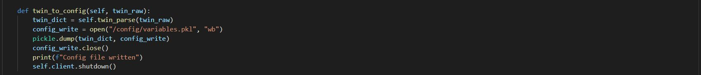
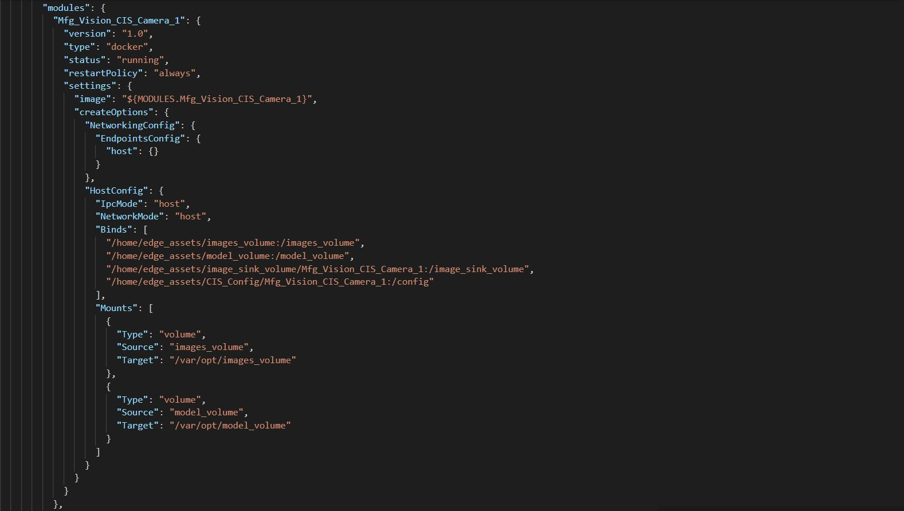
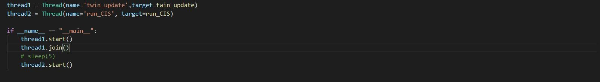
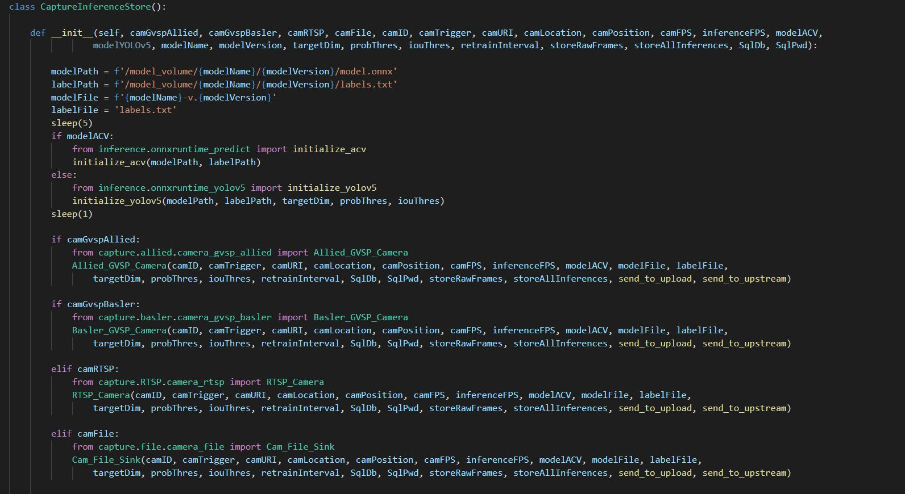
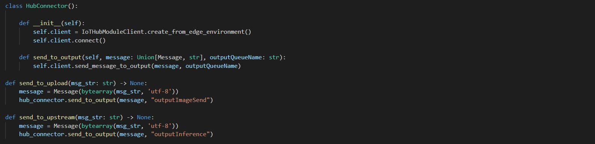

## Mfg_Vision_CIS_Camera_1 Module

This is the main module we'll be working with to connect to caputure, inference and store (CIS) analysis of individual frames.  This module also handles routing the inference and images to Azure in conjunction with the other modules.

If you open this module folder you'll see three directories, capture, inference, and store.  If you click on capture, you'll see a few different options to choose from.  For machine vision systems in industrial environments, it's more common to see GVSP (GigE Vision Streaming Protocol), also known as GigE (gigabit) cameras, such as Allied Vision, Basler and others.  For convenience, we've included two examples, but you can easily integrate addtional camera SDKs as needed. (We'll cover the Dockerfile coniguration a bit later ih this section.)

We also included a simple OpenCV-based connector for RTSP (Real-Time Streaming Protocol), which is quite common for CCTV/Security cameras.

The last option is for a file-based system, where the camera captures the image and simply stores it to a diretory. The python code works as a file watcher, processing the image when uploaded. This is the example we'll be using for this lab, as we won't have a physical camera connected.  This code is also useful in a test environment as part of a CI/CD pipeline.

To start examining the code, let's look at the twin_call.py file. The purpose of this code is to create a connection to edgeHub or IoT Hub in Azure via 'IoTHubModuleClient.create_from_edge_environment()' and harvest the desired state twin information from the module twin in the 'twin_parse' function inside of the 'TwinUpdater' class.  In the 'twin_to_config' function, we're saving the dictionary object output of the 'twin_to_config' functions into a pickle file, variables.pkl, within /config directory of the container.

Corresponding to saving the 'variable.pkl' file, in the deployment manifest, you'll also notice an entry in the "Mfg_Vision_CIS_Camera_1" module under "Binds" that references this directory also.  This effectively stores a copy of the variables.pkl in the 'edge_assets' directory that gets automatically created on your Edge device.

Moving to the main.py file, at the very bottom you'll notice that main.py invokes two defined threads - thread1 calls the 'TwinUpdater' class, which blocks until complete, and thread2, which starts the 'run_CIS' function.  

The 'run_CIS' function loads the variable.pkl file from the /config, and creates variables for each value which are then passed through to the CaptureInferenceStore class, which, depending on the values, then executes the appropriate code for the camera type in the 'capture' directory. 

The HubConnector class builds off of an example from Emmanuel Bertrand's Custom Vision Service repo on Github.
The original repo can be found at https://github.com/Azure-Samples/Custom-vision-service-iot-edge-raspberry-pi  This creates a callable function to handle routing both to other modules and $upstream to IoT Hub.

The 'inference' directory contains three files - two which handle the output tensor from Azure Custom Vision's ONNX export, and one that inteprets the output of a YOLOv5 object detection model, created in Azure Machine Learning AutoML for Images and exported to ONNX.

Within the module folder, there are two Dockerfiles present - one for GPU acceleration using Nvidia and one for CPU acceleration for AVX2/AVX512 capable processors.  Within each of these we've included comments regarding which lines to include/excluded depending on your target camera hardware.  

Please note that to run any of the vision examples, you will need a processor capable of at least AVX (Advanced Vector Instruction Set), regardless of acceleration.  You may run into issues with older Intel NUC devices using Atom or Celeron processors which do not support this.  You can check [Intel's website] (https://www.intel.com/content/www/us/en/support/articles/000057621/processors.html) for more information, or run 'grep flags /proc/cpuinfo' in linux.

[Back to HoL main](../../Hands-on-Lab.md)

